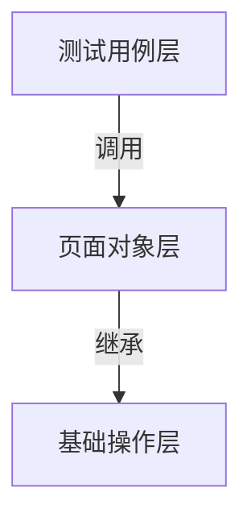
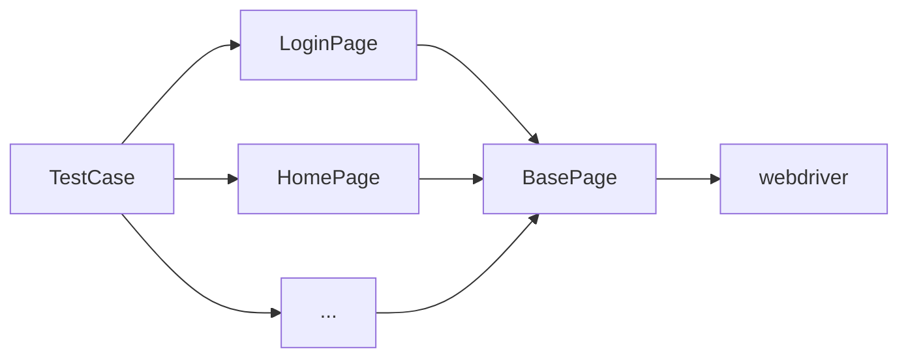

## 自动化测试：PageObject模式（PO模式、POM）的详解

### 导入

作为刚掌握Selenium+Python的测试工程师，你成功编写了自动化测试脚本——通过模拟用户输入账号密码并点击登录按钮，顺利进入系统页面。

当你将这份"测试通过"的报告提交后，却突然收到开发的紧急通知：登录页面的UI组件大改，原先所有元素的XPath/CSS定位路径都已失效。

<br>

此时你发现，必须逐行检查代码中的`driver.find_element(By.XPATH, "//input[@id='old_username']")`等硬编码定位语句，逐个替换成新的选择器。虽然登录模块只需修改3-4个定位路径，工作量看似不大，但如果面对的是一个完整项目集合呢？

试着想象这些场景：

- **设备管理模块**包含数十个表单字段和动态表格
- **订单系统**存在多层嵌套的iframe和Shadow DOM组件
- **管理员后台**涉及数百个权限勾选框和异步加载的弹窗
- **等等...**

<br>

每当前端代码迭代时，你不得不在日益庞大复杂的测试脚本中搜索需要更新的定位器，这种重复劳动不仅效率低下，还会因遗漏修改导致批量测试用例失效。

这正是由于代码过于紧密依赖，导致的经典维护难题。其根本原因在于直接将**脆弱的定位路径与业务逻辑耦合**，违反了软件设计的**单一职责原则**，使得测试代码过于脆弱，任何前端组件的定位路径变更都会引发测试用例的链式失效。这种"牵一发而动全身"的耦合状态，实质上将测试脚本变成了与页面实现细节紧密绑定的寄生代码。

<br>

**Page Object模式** 通过将易变的元素定位器封装在独立的类层，使测试用例仅与稳定的业务操作接口交互，从而切断这种不健康的依赖关系。

<br>

x

---

### 什么是PageObject模式

> Page（页面）Object（对象）

Page Object模式是Web自动化测试中的经典设计模式，其核心思想是通过**三层抽象架构**实现测试逻辑与页面细节的解耦：



<br>

<br>

#### 为什么要用PO模式？

在被测系统处于快速迭代开发阶段时，页面元素往往是容易改变的。

<br>

##### 反面案例

考虑这个反面案例：

```python	
# 元素定位与用例强耦合的写法
def test_login():
    driver.find_element(By.ID, "username").send_keys("admin")  # 元素定位嵌入用例
    driver.find_element(By.CLASS_NAME, "pwd-input").send_keys("123456")
    driver.find_element(By.XPATH, "//button[contains(text(),'登录')]").click()
```

<br>

若登录页输入框ID变为`user_name`，开发者需要逐个修改所有调用该元素的测试用例——这在大型项目中意味着灾难性的维护成本。

<br>

<br>

#### 如何利用PO模式解决问题

> 我们以[反面案例](# 反面案例)为例来对其进行优化

<br>

1. **物理隔离**：创建 `LoginPage` 类来集中管理登录页面的所有元素

<br>

2. **行为封装**：将操作流程抽象为类方法


```python
class LoginPage:
    # 元素定位器集中声明
    USERNAME = (By.ID, "username")
    PASSWORD = (By.CLASS_NAME, "pwd-input")
    SUBMIT_BTN = (By.XPATH, "//button[contains(text(),'登录')]")

    def __init__(self, driver):
        self.driver = driver

    # 业务操作封装
    def login(self, username, password):
        self.driver.find_element(*self.USERNAME).send_keys(username)
        self.driver.find_element(*self.PASSWORD).send_keys(password)
        self.driver.find_element(*self.SUBMIT_BTN).click()
```
<br>

3. **用例简化**：测试用例只需调用页面对象

```python
def test_login():
    login_page = LoginPage(driver)
    login_page.login("admin", "123456")  # 元素变更时不需修改此处
```

<br>

<br>

当元素定位路径变更时，只需修改`LoginPage`类中的常量定义，所有调用该类的测试用例将自动继承更新后的定位策略。通过将易变的元素定位器与稳定的业务操作解耦，**Page Object 模式** 从根本上重构了测试代码的维护范式——元素路径的调整被严格限制在页面对象层内，彻底避免了传统线性脚本元素定位分散导致的多处修改的痛点。

<br>

这种基于封装与抽象的工程实践，使得测试套件在面对开发使其项目的高速迭代时，仍能通过有限的局部修改维持全局稳定性。

<br>

<br>

#### SOLID设计原则

**Page Object 模式**有效地遵循了 **SOLID** 设计原则中的几个关键原则：

1. **单一职责原则（Single Responsibility Principle, SRP）**
   每个页面对象类只负责管理该页面的元素和相关操作，不涉及其他功能。

2. **开闭原则（Open/Closed Principle, OCP）**
   测试用例依赖页面对象类，通过扩展新页面对象类来应对需求变化，而不需要修改现有的测试代码。

3. **依赖倒置原则（Dependency Inversion Principle, DIP）**
   测试用例依赖抽象的页面接口，而非具体的实现（即页面元素定位方式）。

<br>

<br>

x

---

### PO模式的具体实现

> 在前文的优化案例中，我们知道如何将既有代码改造为PO模式。但实际项目中更常见的是**从零开始设计PO架构**。以下是构建PO模式代码的基本结构：

<br>

#### PO模式基本结构




> 架构设计图

<br>

<br>

#### 基础操作层（Base）设计

BasePage作为自动化测试框架的底层核心，其核心价值在于**技术隔离**与**操作标准化**。通过将Selenium WebDriver的全部原生API调用（如元素查找、点击、输入等）收敛到此类中，上层页面对象不再直接操作WebDriver实例，而是通过BasePage提供的标准化方法（如`click()`、`input_text()`）实现业务逻辑。

<br>

这种设计使得当WebDriver因版本升级发生接口变动时（例如Selenium 4修改了`find_element`方法的参数格式），只需在BasePage内部调整对应的封装方法，所有继承BasePage的页面类无需任何修改即可适配新版本，从根本上避免因技术栈变更引发的全局代码重构的风险。

<br>

<br>

##### 实例代码：

```python
from selenium.webdriver.remote.webdriver import WebDriver
from selenium.webdriver.support.wait import WebDriverWait
from selenium.webdriver.support import expected_conditions as EC

class BasePage:
    def __init__(self, driver: WebDriver, timeout: int = 15):
        self.driver = driver
        self.wait = WebDriverWait(driver, timeout)

    def click(self, locator):
        self.wait.until(EC.element_to_be_clickable(locator)).click()

    def input_text(self, locator, text: str):
        element = self.wait.until(EC.visibility_of_element_located(locator))
        element.clear()
        element.send_keys(text)
    
    def get_text(self, loacter):
        pass						# 待写
   	
    def ...
```

以上代码已封装点击和输入等基础操作，其他如拖拽、文件上传等操作可通过添加对应方法实现扩展。所有元素交互最终通过BasePage的统一方法执行，避免底层API的分散调用，并为后续功能扩展保留结构化稳定性。

<br>

<br>

##### 较为健壮的Base层：

```python
from selenium.webdriver.remote.webdriver import WebDriver
from selenium.webdriver.support.wait import WebDriverWait
from selenium.webdriver.support import expected_conditions as EC
from selenium.common.exceptions import TimeoutException, StaleElementReferenceException
from typing import Tuple

class BasePage:
    """所有页面对象的基类，封装通用的Web操作"""
    
    def __init__(self, driver: WebDriver, timeout: int = 15):
        self.driver = driver
        self.wait = WebDriverWait(
            driver, 
            timeout,
            ignored_exceptions=(StaleElementReferenceException,)
            self._url = "instance URL"
        )
    def __open(self, url):
        """打开页面并记录日志"""
        base_url = self._url + url
        logging.info(f"正在打开 URL: {base_url}")
        self.driver.get(base_url)

    def open(self):
        """调用 __open 打开页面"""
        logging.info(f"尝试打开 URL: {self.url}")
        self.__open(self.url)
        logging.info(f"页面 {self.url} 成功打开")

    def _wait_element(self, locator: Tuple[str, str], condition=EC.visibility_of_element_located):
        """元素等待核心方法"""
        try:
            return self.wait.until(condition(locator))
        except TimeoutException as e:
            page_source = self.driver.page_source[:2000]  # 截取部分页面源码
            raise TimeoutException(
                f"元素定位失败: {locator}\n"
                f"当前URL: {self.driver.current_url}\n"
                f"页面源码片段:\n{page_source}..."
            )

    def click(self, locator: Tuple[str, str]):
        """安全点击"""
        element = self._wait_element(locator, EC.element_to_be_clickable)
        element.click()

    def input_text(self, locator: Tuple[str, str], text: str):
        """带清空操作的文本输入"""
        element = self._wait_element(locator)
        element.clear()
        element.send_keys(text)

    def get_text(self, locator: Tuple[str, str]) -> str:
        """获取元素可见文本"""
        return self._wait_element(locator).text.strip()

    def is_element_present(self, locator: Tuple[str, str], timeout: int = 5) -> bool:
        """元素"""
        try:
            WebDriverWait(self.driver, timeout).until(
                EC.presence_of_element_located(locator)
            )
            return True
        except TimeoutException:
            return False
```

<br>

<br>

#### 页面对象层（Page）设计

在页面对象层中，每个Web页面被抽象为独立的类。这些类主要承担两个核心职责：

- **元素定位管理**：集中存放当前页面的所有元素定位参数
- **行为方法封装**：包括针对页面元素的操作（如输入用户名、输入密码）以及转化为可复用的业务语义方法（例如整个登录流程）

<br>

像前面提到的（ [基础操作层](# 基础操作层（BasePage）设计) ）的那样，页面对象与基础层保持明确的依赖关系。通过继承封装了WebDriver通用操作的基础类（如元素查找、等待机制），页面对象类只需关注当前页面特有的元素和行为逻辑。

> 这种设计会存在两个特性：
>
> - 页面对象类不直接调用WebDriver原生接口，所有底层操作均通过基础层二次封装的方法执行
> - 当基础操作层方法升级时，所有继承该层的页面对象自动获得能力更新

<br>

得益于page类的独立性，当某个页面的元素定位器需要修改时（例如 [导入](# 导入) 中提到的困境），开发者只需调整对应页面类的定位参数；若业务操作逻辑变化，也仅需修改该页面类中的关联方法即可确保整个测试体系的稳定运行。

<br>

<br>

##### 实例代码：

```python
class LoginPage(BasePage):
    """页面对象类继承BasePage"""
    USERNAME = (By.ID, "new_username")  		# 元素定位器集中管理
    PASSWORD = (By.CSS_SELECTOR, ".auth-password")
    SUBMIT_BTN = (By.XPATH, "//button[@aria-label='登录']")
	
    """将页面元素交互方法封装"""
    def input_username(self, user: str) -> None:
        self.input_text(self.USERNAME,user)
    
    def input_password(self, pwd: str) -> None:
        self.input_text(self.PASSWORD,pwd)
    
    def click_submit_button(self) -> None:
        self.click(self.SUBMIT_BTN)
    
    """将多个交互方法组合为业务流程"""
    def login(self, user: str, pwd: str) -> HomePage:
        """完整登录业务流程
        参数：
            user: 用户名
            pwd: 密码
        返回：
            HomePage实例对象
        """        
        self.input_username(user)
        self.input_password(pwd)
        self.click_submit_button()
        return HomePage(self.driver)	# 登录后会跳转至主页，因此在函数中返回HomePage页，这样调用 login 方法的代码成功后就可以直接操作 HomePage 页面对象，继续执行相关的业务逻辑。
		
```

<br>

- 将分散在测试脚本中登录页面元素路径（如`//input[@id='old_username']`）集中到类属性中统一调用
	```python
  USERNAME = (By.ID, "new_username")  # 类似仓库货架上的标签
  PASSWORD = (By.CSS_SELECTOR, ".auth-password")
  SUBMIT_BTN = (By.XPATH, "//button[@aria-label='登录']")
	```
    > 当页面元素的ID或结构变化时，只需在此处更新定位器值，所有调用这些属性的方法自动获得新路径。例如将`USERNAME`的ID从`new_username`改为`login-account`，所有使用`self.USERNAME`的方法无需修改。
  
  <br>


- 将基础操作层（[`BasePage类`](# 基础操作层（Base）设计)）方法转化为业务语义明确的指令
	```python
	def input_username(self, user: str) -> None:
      self.input_text(self.USERNAME, user)
  ```

	> 调用BasePage类的成员方法input_text()函数

	<br>
	
- 串联子操作方法，形成业务流程login方法

	```python
	def login(self, user: str, pwd: str) -> HomePage:  
      self.input_username(user)
      self.input_password(pwd)
      self.click_submit_button()
      return HomePage(self.driver)
  ```

	> 执行login方法后会依照顺序执行登录操作，成功后返回`HomePage`对象
	> 如果登录操作需要增加其他功能时（例如验证码步骤），只需要在login方法中添加相应代码即可

整个过程如同更换机械臂上的工具头——只需在工具库更换接口适配器，所有使用该工具的流水线自动适配新工具。

<br>

<br>

#### 测试用例层（TestCase）设计

测试用例层负责整合页面对象层的业务流程方法，集中调度和执行测试逻辑。这一层聚焦于**业务功能的正确性校验**，是自动化测试体系的最终执行层。

<br>

1. **封装**
    在这一层设计中，需要重点关注分层架构和模块化封装：
    通过将下层完整业务流程（如`LoginPage`类的`login`方法）进行封装后提供给上层调用，可避免测试用例直接操作底层页面对象产生的代码冗余。同时严格禁止反向依赖或跨层调用，确保各层级之间保持单向依赖关系以提升架构稳定性。

<br>

2. **测试框架**

   采用pytest/unittest等测试框架，通过分层机制管理测试资源：
    - 使用unittest的`setUp()`/`tearDown()`方法（或pytest的Fixture机制）统一管理浏览器初始化、数据库连接等资源 
    - 为每个测试用例创建独立执行上下文，通过自动化的环境清理机制管理资源的生命周期 
    - 严格隔离测试用例间的运行时状态，从根本上防止状态污染导致的依赖风险

<br>

3. **数据驱动**
   构建数据驱动测试体系时利用框架来使用参数化技术（如`@pytest.mark.parametrize`、`@ddt`）加载外部数据源（`JSON`/`YAML`/`CSV`） 并集中管理测试数据集，最终目的是消除测试代码中的硬编码数据，提升测试代码的灵活性。

<br>

4. **断言**
    `unittest`（及大多数测试框架）通过断言是否抛出异常来判断用例是否通过。若测试方法中所有断言成功（未抛出 `AssertionError`），用例标记为通过；否则标记为失败。

<br>

5. **执行优化与报告**
   断言逻辑可抽离为独立工具函数，提升代码复用性。此外，需充分利用测试框架的高级功能，例如通过插件支持并发执行以提升效率，或集成可视化报告工具生成详尽测试结果。

<br>

<br>

##### 实例代码

```python
import unittest
from ddt import ddt, data, unpack
from selenium.webdriver import Chrome
from pages.login_page import LoginPage
from pages.home_page import HomePage

# 数据处理类
class LoginDataFactory:
    @classmethod
    def load_cases(cls, file_type='json'):
        # 实际项目建议从外部文件加载,例如../test_data下存放json文件
        return [
            {
                "case_id": "TC_LOGIN_001",
                "username": "valid_user",
                "password": "correct_pwd",
                "expected": "home_page"  # 预期跳转首页
            },
            {
                "case_id": "TC_LOGIN_002",
                "username": "invalid_user",
                "password": "wrong_pwd",
                "expected": "error_toast"  # 预期显示错误提示
            },
            {
                "case_id": "TC_LOGIN_003",
                "username": "",
                "password": "empty_username",
                "expected": "disable_submit"  # 预期提交按钮禁用
            }
        ]
        
       
# 测试用例层
@ddt
class TestLoginFlow(unittest.TestCase):
    @classmethod
    def setUpClass(cls):
        cls.driver = Chrome()
    
    def setUp(self):
        self.login_page = LoginPage(self.driver)
        self.login_page.load()

    @data(*LoginDataFactory.load_cases())
    @unpack
    def test_login_scenarios(self, case_id, username, password, expected):
        """ 登录功能数据驱动测试 - {case_id} """
        try:
            # 执行登录业务流程
            next_page = self.login_page.login(username, password)
            
            # 根据预期结果验证
            if expected == "home_page":
                self.assertIsInstance(next_page, HomePage)
                self.assertTrue(next_page.check_welcome_message())
            elif expected == "error_toast":
                self.assertTrue(self.login_page.is_error_toast_visible())
            elif expected == "disable_submit":
                self.assertFalse(self.login_page.is_submit_enabled())
        except Exception as e:
            self.fail(f"Case {case_id}执行失败: {str(e)}")
    
    @classmethod
    def tearDownClass(cls):
        cls.driver.quit()

        
if __name__ == "__main__":
    unittest.main(verbosity=2)
```

- **数据处理类**

  `LoginDataFactory 类`用于为`TestLoginFlow`提供测试数据

  > 通常情况下，数据驱动测试(Data Driven Testing，DDT)会依赖外部数据源(JSON，CSV等) ，而不是像例子一样内嵌在代码中

- **测试用例层**
	测试用例层继承`unittest.TestCase`构建测试框架
	
    - 数据驱动（Data-Driven Testing）
      
        > python的原生unittest框架并不支持ddt，因此需要下载第三方库`pip install ddt`
        
        *使用`@ddt`装饰器和`@data`动态注入多组测试数据，实现单测试逻辑可以覆盖多测试目标（用例）的能力。*
        
    - unittest夹具
  
      - 类级别
        *`setUpClass`方法初始化浏览器实例，所有测试方法共享同一会话*。
        *`tearDownClass`统一关闭浏览器，防止资源泄漏。*
        
      - 用例级别
        每个用例执行前通过`setUp`方法重新加载登录页，消除前序操作对当前测试的干扰。
  

<br>

<br>

x

---

### 自定义

当我们成功构建基于Page Object模式的测试框架，将页面元素定位与业务逻辑优雅分离时，这标志着自动化测试进入了**可维护、可持续迭代**的阶段。但就像汽车装配了优质发动机后，仍需仪表盘和行车记录仪来提升驾驶体验一样——真正的工程效率提升往往始于架构完善后的**场景化适配**。

<br>

例如：

当测试报告中只有简单的"AssertionError"日志时，不得不反复回放测试录像，只为找到究竟是哪个页面的哪个元素未按预期状态显示；每次版本迭代需要逐个执行十几个测试模块，看着命令行窗口不断滚动的日志却无法快速掌握整体进度；团队晨会上被问到"昨晚构建失败的具体原因"时，只能尴尬地回答"还在查日志......"只是因为缺少一份带截图和步骤详情的可视化报告。

<br>

这些并非架构缺陷，而是测试体系从可用走向成熟必须跨越的实用门槛。通过引入：

- **HTMLTestRunner** 生成带执行状态的可视化报告
- **失败用例自动截图** 功能快速定位页面异常
- **run_test.py** 一键批量执行所有测试模块

<br>

我们可以用极低的成本实现三大提升：

1. 测试结果**可视化呈现**，方便非技术人员迅速领会
2. 故障现场**自动留档**，有效解决 “无法复现” 的困扰
3. 执行流程**标准化**，即便新人也能独立操作完整测试套件

<br>

<br>

#### HTMLTestRunner

在[github](https://github.com/oldani/HtmlTestRunner)上有详细的安装教程于如何使用，在这里我们简单叙述一下：

##### 安装

在终端中下载html-testRunner

```shell
$ pip install html-testRunner
```

##### 使用

如果没有使用测试套件（后续会讲到），可以使用`unittest.main`，放在`unittest`框架的`if __name__ == '__main__':`下:

```python
if __name__ == '__main__':
    unittest.main(testRunner=HtmlTestRunner.HTMLTestRunner())
```

使用测试套件也非常简单，创建一个 Runner 实例并让套件调用 Run 方法即可，下面是github的使用教程中的实例：
```python
from unittest import TestLoader, TestSuite
from HtmlTestRunner import HTMLTestRunner
import ExampleTest
import Example2Test

example_tests = TestLoader().loadTestsFromTestCase(ExampleTest)
example2_tests = TestLoader().loadTestsFromTestCase(Example2Test)

suite = TestSuite([example_tests, example2_tests])

runner = HTMLTestRunner(output='example_suite')

runner.run(suite)
```

<br>

<br>

#### 截图

##### 在[基本操作层（BasePage）](# 基础操作层（Base）设计)中封装页面截图代码

代码实例

```python
# base_page.py
import time
import os

class BasePage:
    def __init__(self, driver):
        self.driver = driver
    
    def take_screenshot(self, case_name: str) -> str:
        """返回带路径的截图文件名"""
        # 创建截图目录
        screenshot_dir = os.path.join(os.getcwd(), "screenshots")
        os.makedirs(screenshot_dir, exist_ok=True)
        
        # 生成唯一文件名
        timestamp = int(time.time())
        filename = f"{case_name}_{timestamp}.png"
        filepath = os.path.join(screenshot_dir, filename)
        
        # 截图并返回绝对路径
        self.driver.save_screenshot(filepath)
        return os.path.abspath(filepath)

```

<br>

##### 在TestCase类中修改夹具实现异常捕获

代码实例

```python
# test_login.py
import unittest
from base_page import BasePage

class TestLogin(unittest.TestCase):
    def setUp(self):
        # 初始化浏览器驱动
        self.driver = webdriver.Chrome()
        # 创建页面对象时传入driver
        self.login_page = BasePage(self.driver)  # 或您的具体页面类
        
    def tearDown(self):
        # 捕获测试失败状态
        if self._testFailed:  # unittest内置的失败标志
            screenshot_path = self.login_page.take_screenshot(self.id())
            print(f"截图保存至: file://{screenshot_path}")
        
        # 关闭浏览器
        self.driver.quit()
    
    def test_invalid_login(self):
        try:
            if self._testFailed or hasattr(self, '_outcome') and self._outcome.result.errors:
                # 捕获断言失败和代码异常
                screenshot_path = self.login_page.take_screenshot(self.id())
                print(f"[异常截图] file://{screenshot_path}")
        finally:
            self.driver.quit()  # 确保浏览器始终关闭

```

<br>

<br>

#### 测试套件（Test Suite）

> 测试套件是 **测试用例的容器**，用于将多个测试用例/测试类按照特定策略组织起来，实现批量执行。相当于把分散的测试方法打包成一个可统一执行的"测试包"。

在组成了unittest 的测试套件后，需要loader加载器来将其加载

##### **`TestSuite`**测试套件

```python
suite.addTest(test_case)  		# 添加单个测试
suite.addTests([test1, test2])  # 批量添加测试
```

##### `TestLoader` 测试加载器	

```python
loader.loadTestsFromTestCase(TestClass)  # 加载单个测试类
loader.loadTestsFromModule(module)       # 加载整个模块的测试
loader.discover(start_dir, pattern="test*.py")  # 自动发现目录下的测试
```

<br>

<br>

##### 集成[测试报告](# HTMLTestRunner)的示例代码

```python
from unittest import TestLoader, TestSuite
from HtmlTestRunner import HTMLTestRunner
import os
import time

# 导入测试用例类
from test_login import TestLogin

# 自动生成带时间戳的报告路径
report_dir = os.path.join(os.getcwd(), "test_reports")
os.makedirs(report_dir, exist_ok=True)
report_file = os.path.join(report_dir, f"report_{time.strftime('%Y%m%d_%H%M%S')}.html")

# 配置增强版HTMLTestRunner
runner = HTMLTestRunner(
    output=report_dir,  # 测试报告存放目录
    report_name=os.path.basename(report_file),
    add_timestamp=False  # 已在文件名中处理时间戳，因此不需要添加时间戳
)

# 动态构建测试套件
suite = TestSuite()
loader = TestLoader()
suite.addTest(loader.loadTestsFromTestCase(TestLogin))  # 添加你的测试类

runner.run(suite)
```

<br>

<br>

<br>

Fin.


